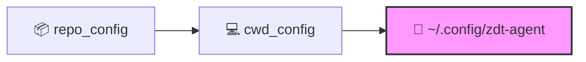

# 🤖 zdt-agent

> **LangGraph-based agent runtime** featuring Model Context Protocol (MCP) integration, sandboxed shell tooling, configurable execution policies, embedding-based retrieval, and a dynamic lorebook prompt manager.

---

## ✨ Features

- **🛡️ Execution Policies** — Work mode, network kill-switch, and a 5-level granular tool approval workflow.
- **🔌 MCP Federation** — Seamlessly aggregates tools from configured MCP servers; automatically skips unavailable or offline servers.
- **🐚 Shell Tooling** — Secure, sandboxed command execution with configurable timeouts and designated working directories.
- **🧠 Embedding Knowledge Base (EKB)** — Semantic retrieval over indexed files, fully managed via the `zdt_agent_kb` utility.
- **📚 Prompt Manager** — Dynamic lorebooks stored under `prompts/lorebooks/`. Every turn follows a strict pipeline: **Match ➔ Filter ➔ Expand ➔ Inject**. (See [doc/prompt_manager.md](doc/prompt_manager.md)).
- **🐳 Docker Ready** — Production-ready Dockerfiles and automated startup scripts included out-of-the-box.

## 🚀 Quick Start

### 📋 Prerequisites

- [uv](https://github.com/astral-sh/uv) (Fast Python package installer and manager)
- Python 3.12+
- Ports `8000`–`8002` free (reserved for default MCP servers)

### 💻 Local Development

#### 1. Clone & Setup

```bash
# Clone the repo along with the MCP submodules
git clone --recurse-submodules git@github.com:zeroDtree/agent.git
cd agent

# Install dependencies using uv
uv sync
```

#### 2. Configure Environment

Create your environment variables or export them in your terminal:

```bash
export LLM_API_KEY="your_api_key"
export LLM_API_BASE="https://your-provider.example/v1"
```

#### 3. Run the Agent

```bash
# Start MCP servers and the agent CLI together
bash shell_scripts/start.sh
```

> 💡 `start.sh` spins up MCP servers on ports `8000`–`8002` (math, code lint, knowledge graph), waits for their readiness, and then launches `zdt_agent`. Press **Ctrl+C** to gracefully stop both the agent and the servers.

**Alternative: Run CLI Only** (if MCP servers are already running via `bash shell_scripts/start_mcp.sh --wait`):

```bash
uv run zdt_agent [hydra overrides...]
```

### 🔧 Common Hydra Overrides

Append these flags to your startup commands to customize behavior:

```bash
bash shell_scripts/start.sh \
  ++work.tool_approval=whitelist_accept \
  ++work.working_directory=/tmp/work_dir
```

Default model and system settings reside under `config/`. See [Resource Resolution](#resource-resolution) for details on override precedence.

### 🐳 Docker Deployment

```bash
# 1. Set environment variables
export LLM_API_KEY="your_api_key"
export LLM_API_BASE="https://your-provider.example/v1"

# 2. Build and run
bash shell_scripts/build_docker.sh
bash shell_scripts/start.docker.sh [hydra overrides...]
```

> ⚠️ **Volume Mapping Notice:**
>
> The container automatically mounts the repository root at `/tmp/proj_dir` and a writable workspace at `/tmp/work_dir`.
>
> **Best Practice:** Read project definitions and configs from `/tmp/proj_dir`.
> **Best Practice:** Write all runtime artifacts, logs, and outputs to `/tmp/work_dir`.


## 🔍 Resource Resolution

Paths and environmental assets are dynamically resolved by [src/zdt_agent/paths.py](src/zdt_agent/paths.py):

| Resource                                | Resolution                                                                          |
| :-------------------------------------- | :---------------------------------------------------------------------------------- |
| **Repo Root**                           | Walks up from the installed package looking for `.project-root`, or respects `AGENT_REPO_ROOT`. |
| **`config/` / `prompts/` / `schemas/`** | Prefers `cwd/<name>/` if present; otherwise gracefully falls back to the repo root. |

**Config Precedence (Hydra Layers)** — configuration layers are stacked sequentially; later entries override earlier ones ([config/config.yaml](config/config.yaml)):




## 📖 Further Documentation

- 📄 [doc/embedding_knowledge_base.md](doc/embedding_knowledge_base.md) — EKB usage details and `zdt_agent_kb` CLI guide.
- 📄 [doc/prompt_manager.md](doc/prompt_manager.md) — Deep dive into the lorebook pipeline and preset assembly.
- 📄 [doc/agent_concept.md](doc/agent_concept.md) — Comprehensive view of the core agent architecture and design concepts.
