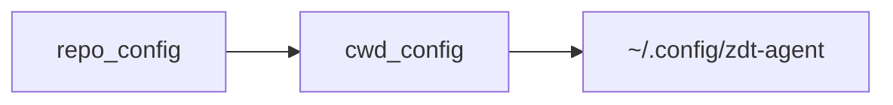

# zdt-agent

LangGraph-based agent runtime with MCP integration, shell tooling, configurable execution policies, embedding retrieval, and a lorebook prompt manager.

## Features

- **Execution policies** — Work mode, network switch, and five-level tool approval
- **MCP federation** — Tools from configured MCP servers; unavailable servers are skipped.
- **Shell tooling** — Sandboxed commands with configurable timeout and working directory.
- **Embedding Knowledge Base (EKB)** — Semantic retrieval over indexed files; manage via `zdt_agent_kb`.
- **Prompt manager** — Lorebooks under `prompts/lorebooks/`; match → filter → expand → inject each turn. See [doc/prompt_manager.md](doc/prompt_manager.md).
- **Docker support** — Build and startup scripts included.

## Quick start

**Prerequisites:** [uv](https://github.com/astral-sh/uv); MCP ports `8000`, `8001`, `8002` available.

**Clone and init:**

```bash
git clone --recurse-submodules git@github.com:zeroDtree/agent.git
cd agent
```

**Required env** (LLM requests):

```bash
export LLM_API_KEY="your_api_key"
export LLM_API_BASE="https://your-provider.example/v1"
```

**Run** (recommended — starts MCP servers, then the agent):

```bash
bash shell_scripts/start.sh [hydra overrides...]
```

Or run the CLI directly (MCP must already be running):

```bash
uv run zdt_agent [hydra overrides...]
```

Common overrides:

```bash
bash shell_scripts/start.sh \
  ++work.tool_approval=whitelist_accept \
  ++work.working_directory=/tmp/work_dir
```

### Run in docker container

```bash
bash shell_scripts/build_docker.sh
bash shell_scripts/start.docker.sh [hydra overrides...]
```

Mounts: project at `/tmp/proj_dir`, writable workspace at `/tmp/work_dir`. Best practice: read from `/tmp/proj_dir`, write artifacts to `/tmp/work_dir`.


## Resource resolution

Paths are resolved by [src/zdt_agent/paths.py](src/zdt_agent/paths.py):

| Resource                                | Resolution                                                                        |
| --------------------------------------- | --------------------------------------------------------------------------------- |
| **Repo root**                           | Walk up from the installed package for `.project-root`, or set `AGENT_REPO_ROOT`. |
| **`config/` / `prompts/` / `schemas/`** | Use `cwd/<name>/` if it exists; otherwise fall back to repo root.                 |

Hydra config layers ([config/config.yaml](config/config.yaml); later entries override earlier):




### Lorebooks

Enable via `lorebook_ids` in [config/char/default.yaml](config/char/default.yaml). Default loads `coding-default` only. For Knowledge Graph memory, add `knowledge-graph` and run the `knowledge_graph` MCP server:

```yaml
lorebook_ids:
  - "coding-default"
  - "knowledge-graph"
```

Source entries live under `prompts/lorebooks/*/entries/*.md` (resolved via `prompts_dir()`).

### MCP runtime

Two config sources:

- [mcp/config.yaml](mcp/config.yaml) — process launch (`transport`, `host`, `port`, `enabled`)
- [config/mcp/default.yaml](config/mcp/default.yaml) — agent-side discovery endpoints

| Server            | Launch         | Agent endpoint              |
| ----------------- | -------------- | --------------------------- |
| `math`            | `0.0.0.0:8000` | `http://127.0.0.1:8000/mcp` |
| `code_lint`       | `0.0.0.0:8001` | `http://127.0.0.1:8001/mcp` |
| `knowledge_graph` | `0.0.0.0:8002` | `http://127.0.0.1:8002/mcp` |

## Execution policies

Three independent axes:

| Axis          | Config                 | CLI         |
| ------------- | ---------------------- | ----------- |
| Work mode     | `work.work_mode`       | `!mode`     |
| Network       | `work.network.enabled` | `!network`  |
| Tool approval | `work.tool_approval`   | `!approval` |

**Work modes**

| Mode | Shell      | Tools        | Use                                     |
| ---- | ---------- | ------------ | --------------------------------------- |
| `ro` | read-only  | read         | Explore code                            |
| `sw` | read-only  | read + write | Safe structured edits                   |
| `aw` | read-write | read + write | Full shell writes                       |
| `pl` | read-only  | read + plan  | Plans under `.agent/plans/<thread_id>/` |

**Tool approval** (`work.tool_approval`)

| Policy             | Behavior                           |
| ------------------ | ---------------------------------- |
| `manual`           | Confirm every tool call            |
| `blacklist_reject` | Auto-reject writes; confirm others |
| `universal_reject` | Block all tools                    |
| `whitelist_accept` | Auto-approve reads; confirm writes |
| `universal_accept` | Fully automatic                    |

MCP tool tags: [config/mcp_tools/default.yaml](config/mcp_tools/default.yaml) — use `tool_defaults`

When network is off, shell and MCP tools tagged `needs_network` are blocked.

## CLI commands

After startup, any line that is not a command below is sent to the model. Matched lorebook entries may print each turn.

| Command                            | Description                                                                    |
| ---------------------------------- | ------------------------------------------------------------------------------ |
| `exit` / `quit`                    | Exit the CLI                                                                   |
| `!help`                            | Print command summary                                                          |
| `!mode` / `!mode list` / `!mode ro\|sw\|aw\|pl` | Show, list, or switch work mode (AW confirms) |
| `!network` / `!network list` / `!network on\|off` | Show, list, or toggle outbound network (on confirms) |
| `!approval` / `!approval list` / `!approval <policy>` | Show, list, or switch tool approval (`whitelist_accept` / `universal_accept` confirm) |
| `!tool list`                       | List tools for current mode                                                    |
| `!tool <name> [json_args]`         | Invoke a tool (`{}` if args omitted)                                           |
| `!char list`                       | List roles in `char.prompt_dir` (default `chars` under `prompts_dir()`)        |
| `!char show`                       | Show active role and prompt path                                               |
| `!char set <role>`                 | Switch active role                                                             |
| `!save <filename>`                 | Save conversation JSON                                                         |
| `!load <filename>`                 | Append messages from file (use `!clear` first to replace)                      |
| `!preset`                          | Print last assembled preset messages                                           |
| `!clear`                           | Clear in-memory history                                                        |
| `!history`                         | Print history (120-char truncation)                                            |

Tip: `++llm.show_reasoning=true` prints model reasoning when available.

## Add local tools

Implement under `src/zdt_agent/tools/`, tag with `ToolCapability`, register in `_build_local_tools()`.


## Further documentation

- [doc/embedding_knowledge_base.md](doc/embedding_knowledge_base.md) — EKB usage and `zdt_agent_kb`
- [doc/prompt_manager.md](doc/prompt_manager.md) — lorebook pipeline and preset assembly
- [doc/agent_concept.md](doc/agent_concept.md) — agent architecture concepts
