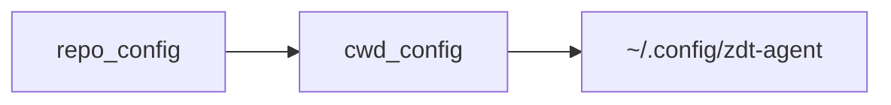

# zdt-agent

LangGraph-based agent runtime with MCP integration, shell tooling, configurable execution policies, embedding retrieval, and a lorebook prompt manager.

## Features

- **Execution policies** — Work mode, network switch, and five-level tool approval
- **MCP federation** — Tools from configured MCP servers; unavailable servers are skipped.
- **Shell tooling** — Sandboxed commands with configurable timeout and working directory.
- **Embedding Knowledge Base (EKB)** — Semantic retrieval over indexed files; manage via `zdt_agent_kb`.
- **Prompt manager** — Lorebooks under `prompts/lorebooks/`; match → filter → expand → inject each turn. See [doc/prompt_manager.md](doc/prompt_manager.md).
- **Docker support** — Build and startup scripts included.

## Quick start

**Prerequisites:** [uv](https://github.com/astral-sh/uv), Python 3.12+, ports `8000`–`8002` free for MCP servers.

### Local

```bash
# 1. Clone (includes the mcp submodule used by start.sh)
git clone --recurse-submodules git@github.com:zeroDtree/agent.git
cd agent

# 2. Install dependencies
uv sync

# 3. Configure LLM (required for chat)
export LLM_API_KEY="your_api_key"
export LLM_API_BASE="https://your-provider.example/v1"

# 4. Start MCP servers, then the agent CLI
bash shell_scripts/start.sh
```

`start.sh` starts MCP on `8000`–`8002` (math, code lint, knowledge graph), waits until they are ready, then runs `zdt_agent`. Press Ctrl-C to stop the agent and MCP together.

**Run the CLI only** (MCP must already be running, e.g. via `bash shell_scripts/start_mcp.sh --wait`):

```bash
uv run zdt_agent [hydra overrides...]
```

**Common Hydra overrides** (append to either command):

```bash
bash shell_scripts/start.sh \
  ++work.tool_approval=whitelist_accept \
  ++work.working_directory=/tmp/work_dir
```

Default model and other settings live under `config/`; see [Resource resolution](#resource-resolution) for override order.

### Docker

```bash
export LLM_API_KEY="your_api_key"
export LLM_API_BASE="https://your-provider.example/v1"

bash shell_scripts/build_docker.sh
bash shell_scripts/start.docker.sh [hydra overrides...]
```

The container mounts the repo at `/tmp/proj_dir` and a writable workspace at `/tmp/work_dir`. Prefer reading project files from `/tmp/proj_dir` and writing artifacts to `/tmp/work_dir`.


## Resource resolution

Paths are resolved by [src/zdt_agent/paths.py](src/zdt_agent/paths.py):

| Resource                                | Resolution                                                                        |
| --------------------------------------- | --------------------------------------------------------------------------------- |
| **Repo root**                           | Walk up from the installed package for `.project-root`, or set `AGENT_REPO_ROOT`. |
| **`config/` / `prompts/` / `schemas/`** | Use `cwd/<name>/` if it exists; otherwise fall back to repo root.                 |

Hydra config layers ([config/config.yaml](config/config.yaml); later entries override earlier):




## Further documentation

- [doc/embedding_knowledge_base.md](doc/embedding_knowledge_base.md) — EKB usage and `zdt_agent_kb`
- [doc/prompt_manager.md](doc/prompt_manager.md) — lorebook pipeline and preset assembly
- [doc/agent_concept.md](doc/agent_concept.md) — agent architecture concepts
