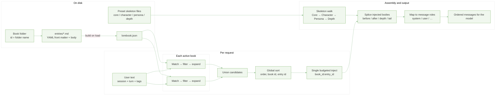

# How the prompt system works

**Static preset bones + conditional lorebook meat**, selected by triggers and session rules, merged under a token budget, and laid out into one ordered conversation for the model.

The system has two ideas: 
- **lorebooks** (dynamic snippets that may attach when the conversation matches rules)
- **preset skeleton** (fixed blocks such as system core, character, and persona). 

At request time, matching lorebook text is merged into that skeleton and becomes the model’s context.

---

## Architecture

- **Book id** = folder name; **entry id** = front-matter `id` or filename stem.
- Markdown sources trigger **rebuild on load**; JSON-only books load as-is.
- Runtime inputs: user text, session identity, turn index, optional tags.
- Filter stage covers probability, cooldowns, stickiness, etc.; expand handles recursive pulls.
- Global budget is conceptually the **sum of per-book budgets**; injected keys are **`book_id:entry_id`**.
