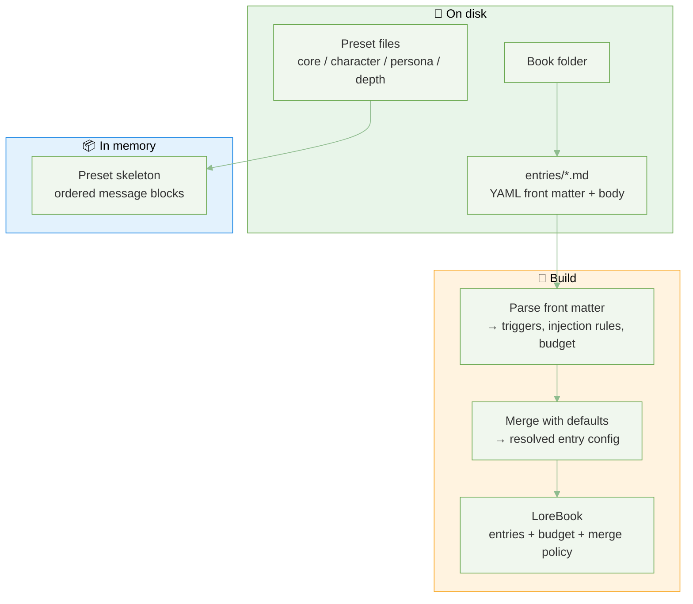
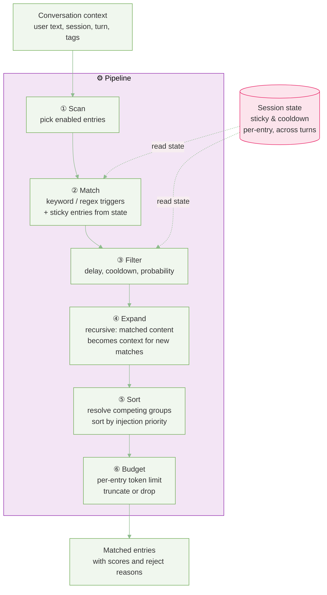
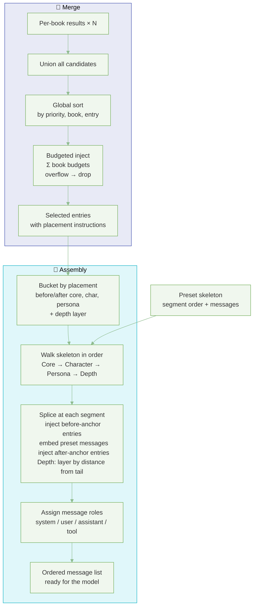

# How the prompt system works

**Static preset bones + conditional lorebook meat**, selected by triggers and session rules, merged under a token budget, and laid out into one ordered conversation for the model.

The system has two ideas: 
- **lorebooks** (dynamic snippets that may attach when the conversation matches rules)
- **preset skeleton** (fixed blocks such as system core, character, and persona). 

At request time, matching lorebook text is merged into that skeleton and becomes the model’s context.

---

## Architecture

### 1. Build & Load

Markdown entries and preset files on disk → parsed and assembled into in-memory objects.

- **Book id** = folder name; **entry id** = front-matter `id` or filename stem.
- Markdown sources trigger **rebuild on load**; front matter is merged with per-field defaults.
- Preset files load once and produce the fixed skeleton reused across all requests.

---

### 2. Per-Book Pipeline

One pipeline per active lorebook. Six stages scan entries against the current conversation and produce matched + filtered + sorted candidates.

- **Match**: scans user text against keywords and regex; sticky entries re-trigger automatically.
- **Filter**: gates entries by delay turns, cooldown, and random probability.
- **Expand**: matched entries marked recursive have their own body scanned for further matches (breadth-first, depth-limited).
- **Sort**: entries in the same inclusion group compete (by match score or priority); survivors are ordered.
- Session state persists sticky and cooldown counters **across turns**.

---

### 3. Merge & Assembly

Results from all active books are merged under a global token budget, then spliced into the preset skeleton at annotated anchor points.

- **Placement anchors**: `before_core`, `after_core`, `before_character`, `after_character`, `before_persona`, `after_persona`, `depth`, or overflow (appended at end).
- Within each anchor, entries sort by priority; depth entries sort by distance from the newest message.
- Each entry maps to a message role; `system` is the default.
- Injected keys are `book_id:entry_id`; global budget is the sum of per-book budgets.
