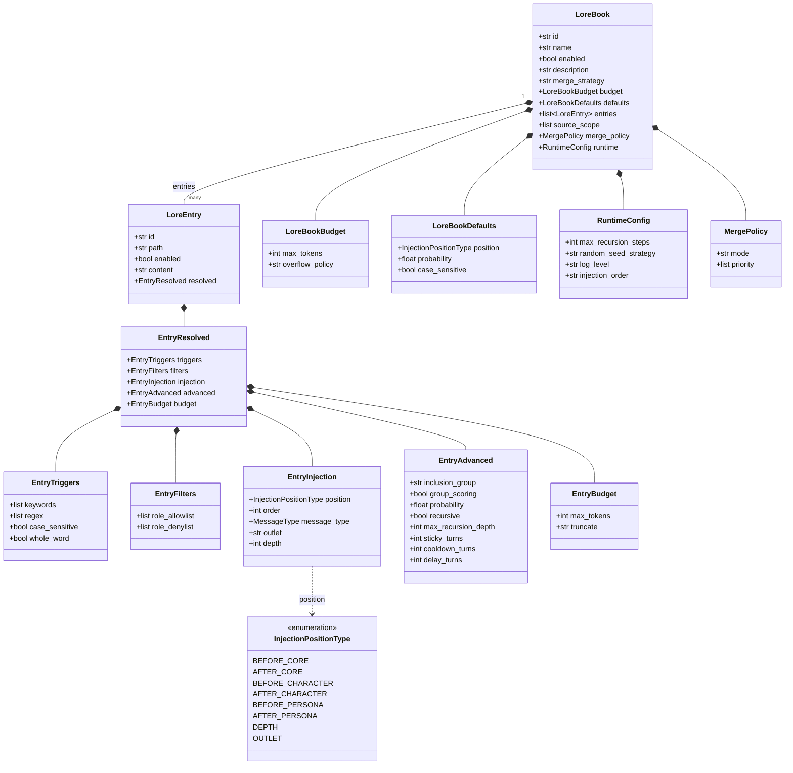
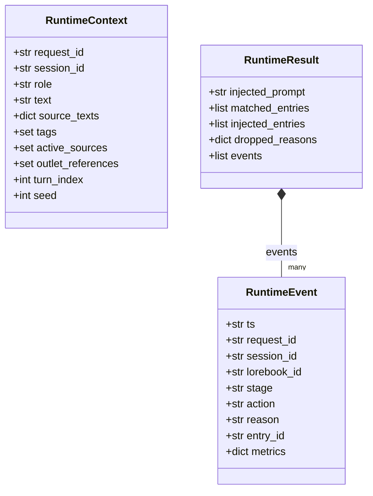

# Prompt manager (inspired by [SillyTavern World Info](https://docs.sillytavern.app/usage/core-concepts/worldinfo/))

This document describes the **implemented** Python package `prompt_manager`: data shapes, build/load, runtime pipeline, and the LangChain-oriented preset helper. Field types match `prompt_manager/types` and `schemas/lorebook.schema.json` unless noted.

Open the Mermaid blocks in a Mermaid-capable viewer (IDE preview, GitHub, etc.).

---

## Responsibilities

| Piece                                   | Role                                                                                                                                                                                                                                                                         |
| --------------------------------------- | ---------------------------------------------------------------------------------------------------------------------------------------------------------------------------------------------------------------------------------------------------------------------------- |
| `prompt_manager.builder.build_lorebook` | Reads `entries/*.md` (YAML front matter + body), merges book defaults, writes `lorebook.json`.                                                                                                                                                                               |
| `prompt_manager.loader.load_lorebook`   | Parses `lorebook.json` into `LoreBook` and nested dataclasses.                                                                                                                                                                                                               |
| `LoreBookRuntimeEngine`                 | Runs **scan → match → filter → expand → sort → inject** for one book; produces `RuntimeResult` (concatenated `injected_prompt`, entry ids, events).                                                                                                                          |
| `MultiLoreBookRuntimeEngine`            | Runs the pre-inject pipeline per book, then **globally** orders candidates and applies a **combined** token budget (sum of each book’s `budget.max_tokens`).                                                                                                                 |
| `prompt_manager.preset`                 | Host integration: runs lorebook runtime with `RuntimeContext`, maps injections to **LangChain** `BaseMessage` lists and anchor positions (`before_core`, `after_character`, …). Optional `LoreBookEventLogger` appends `RuntimeEvent` lines to `logs/lorebook-events.jsonl`. |

---

## Runtime pipeline (single book)

1. **scan** — Collect enabled entries; skip whole book if `LoreBook.enabled` is false.
2. **match** — Keyword / regex against **combined** text: `RuntimeContext.text` plus `source_texts` entries whose scope is both in `active_sources` and in the book’s `source_scope`. Sticky / cooldown / delay are applied via `LoreBookSessionState` (see `session_state.py`).
3. **filter** — Role allow/deny lists and probability gates (`EntryAdvanced.probability`, seeded per `RuntimeConfig.random_seed_strategy` unless `RuntimeContext.seed` is set).
4. **expand** — For entries with `advanced.recursive`, re-run match/filter on nested text up to `runtime.max_recursion_steps` waves.
5. **sort** — Inclusion groups: at most one winner per `advanced.inclusion_group` (optional `group_scoring` using match scores). Then order by `EntryInjection.order` according to `runtime.injection_order` (`small_first` vs `great_first`).
6. **inject** — Enforce per-entry budget (`EntryBudget`), then book budget (`LoreBookBudget`): either `drop_low_priority` or merge-and-truncate (`truncate_tail` / `truncate_head`). Outlets: entries with `injection.outlet` set are dropped unless that name appears in `RuntimeContext.outlet_references`.

**Multi-book:** each engine runs through **expand**; then all candidates are sorted by `(injection.order, lorebook.id, entry.id)` and injected under one shared budget. This path does **not** read `merge_strategy` or `merge_policy` (those fields are stored for schema/interop; the current multi-book merge behavior is fixed as above).

**Structured logging:** `RuntimeEvent` uses `stage` in `{"scan","match","filter","expand","sort","inject"}` (see `Stage` in `types/lorebook.py`). `RuntimeEvent.action` / `reason` are short strings from the engine (e.g. `matched`, `dropped`, `keyword_hit`).

---

## LoreBook type model (dataclasses)

Types live in `prompt_manager/types/lorebook.py`. `InjectionPositionType` is a `StrEnum` of string values consumed by the host (`preset` maps them to segment boundaries).

Diagram notes (precision):

- **`merge_strategy` / `MergePolicy.mode`:** literals `global_sorted_merge` \| `character_first` in code and schema. The runtime engines above do not branch on these today.
- **`EntryInjection`:** `message_type` is `MessageType | None` (see `types/conversation.py`). `outlet` is `str | None`. `depth` is `int | None` (used when `position` is `DEPTH`).
- **`EntryBudget.truncate`:** `Literal["head","tail","none"]`.
- **`LoreBookBudget.overflow_policy`:** `Literal["drop_low_priority","truncate_tail","truncate_head"]`.
- **`RuntimeConfig`:** `random_seed_strategy` is `session_stable` \| `request_random`; `log_level` is `off` \| `normal` \| `debug`; `injection_order` is `small_first` \| `great_first`.
- **`source_scope`:** elements are `Literal["global","character","persona","chat"]`.

---

## Activation types (`types/runtime.py`)

`RuntimeContext.seed` is `int | None` in code (optional override for probability seeding). See `types/runtime.py` for defaults on other fields.

---

## Conversation-layer types (`types/conversation.py`)

Used for higher-level prompt assembly (not the JSON lorebook file):

- **`Message`**, **`MessageType`** (`system` \| `user` \| `assistant` \| `tool`).
- **`Preset`**, **`Chat`**, **`PersonaMessages`:** type aliases for `list[Message]` (semantics differ by usage).
- **`CharacterCard`**, **`Persona`:** identity + optional `lorebook_ids` on the character side.

---

## Schema and codegen

- **`schemas/lorebook.schema.json`** — JSON Schema for `lorebook.json` (aligned with builder output and loader).
- Field descriptions on dataclasses use `field(metadata=...)` via `types/common.py` for tooling.

---

## Related files (reference)

| Path                                     | Purpose                              |
| ---------------------------------------- | ------------------------------------ |
| `prompt_manager/builder.py`              | Compile entries → JSON               |
| `prompt_manager/loader.py`               | JSON → `LoreBook`                    |
| `prompt_manager/runtime/engine.py`       | `LoreBookRuntimeEngine`              |
| `prompt_manager/runtime/orchestrator.py` | `MultiLoreBookRuntimeEngine`         |
| `prompt_manager/preset.py`               | LangChain messages + segment anchors |
| `prompt_manager/logger.py`               | JSONL event append                   |
