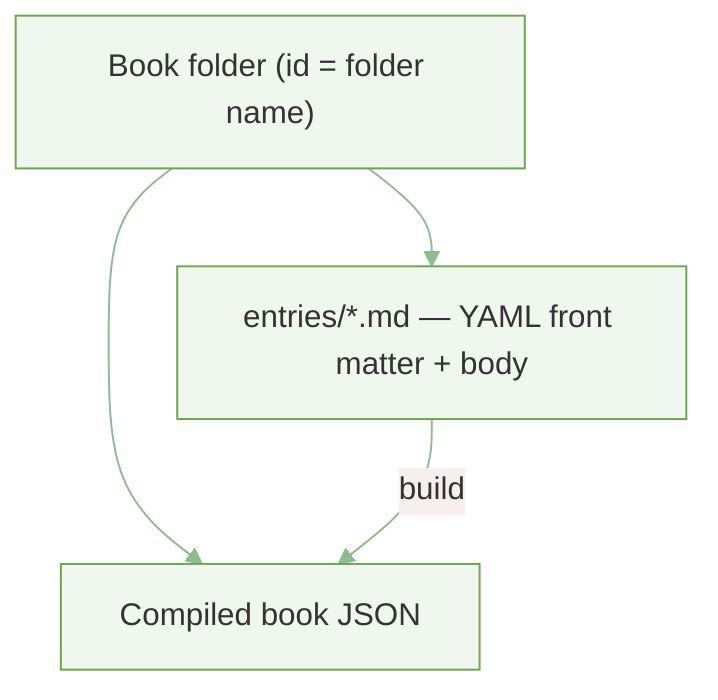
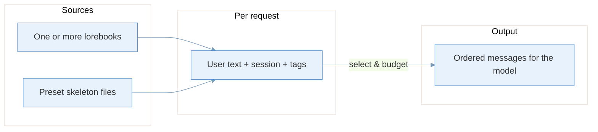
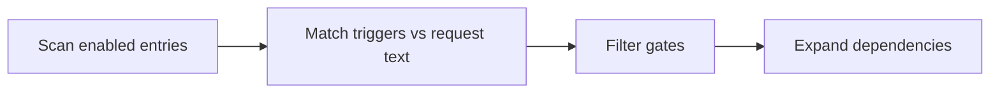
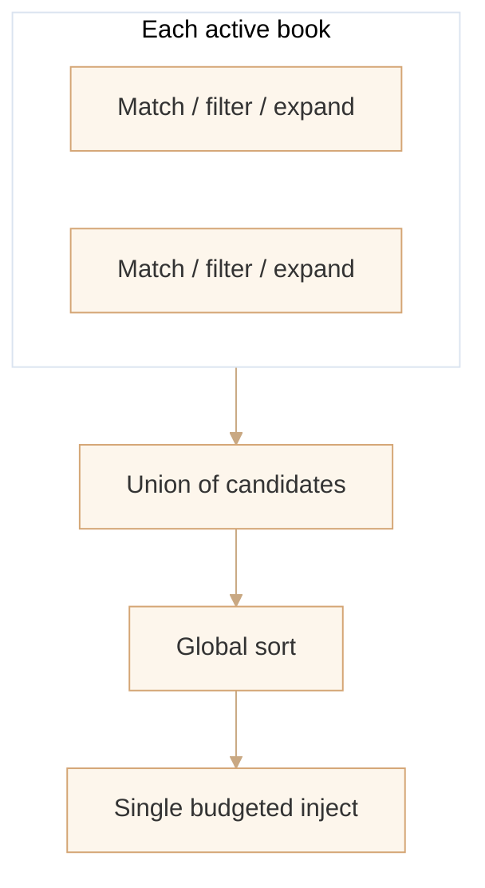
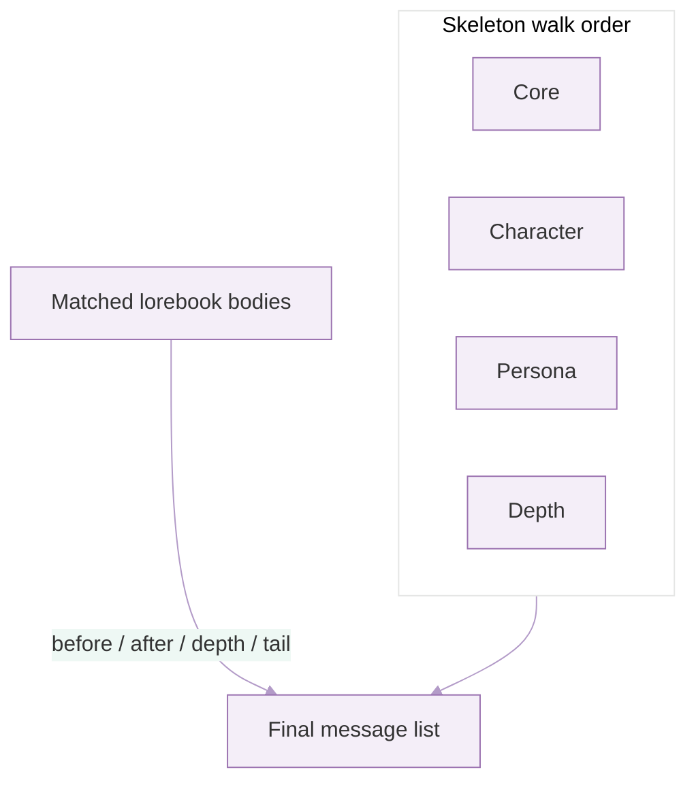

# How the prompt system works

The system has two ideas: **lorebooks** (dynamic snippets that may attach when the conversation matches rules) and a **preset skeleton** (fixed blocks such as system core, character, and persona). At request time, matching lorebook text is merged into that skeleton and becomes the model’s context.

---

## What lives on disk

Each lorebook is a **folder** named by its book id. Inside it, Markdown files under `entries/` hold one rule-bearing snippet each. A build step turns those files into a single JSON artifact the runtime reads.

- **Book id** = the folder name, not a single file.
- **Entry id** = optional `id` in front matter; if omitted, it defaults to the file name without the `.md` suffix.
- If Markdown sources are present, the book is typically **rebuilt** when loaded so edits apply without a separate compile step; if only the JSON exists, that file is used as-is.

---

## End-to-end shape

The runtime sees **user text**, **session identity**, **turn index**, and optional **tags**. Lorebook entries that **match** can be **filtered** (probability, cooldowns, stickiness, etc.), **expanded** (e.g. recursive pulls), then **ordered** and **injected** under a **shared token budget**. The preset layer then **splices** that injected content into the skeleton at configured positions (next to core / character / persona, by depth, or as overflow).

---

## Single-book pipeline (conceptual)

**Match** uses triggers (keywords, regex, case flags, etc.) against the incoming text (and related sources when active). **Filter** applies per-entry rules so not every match becomes content. **Expand** can pull in linked entries so the final set is closed before ordering.

**Sort** and **budgeted injection** happen when results from one or more books are merged: entries get an ordering key; the pipeline walks them and stops adding text when the combined budget is exhausted, recording what was dropped and why.

---

## Multiple books

When several lorebooks are active, each book runs the **match → filter → expand** path on the **same request**, then **orders** its own expanded set. All candidates are **combined**, **re-sorted globally** (order, then book id, then entry id), and **one** injection pass applies **one** total budget (conceptually: sum of per-book budgets). Injected items are tracked as **book id : entry id** so names stay unambiguous.

---

## Preset skeleton + where lorebook text lands

The skeleton is a **fixed sequence of segments** (e.g. core instructions, optional character block, optional persona, optional depth-oriented block). Lorebook entries declare **where** they attach: before or after a segment, relative to **depth** in the thread, or unknown placement falls to the **end**.

Each injected snippet can also map to a **message role** (e.g. system vs user) so the merged list stays valid for the chat API.

---

## Defaults and observability

If the caller does not pick lorebooks, the integration may fall back to a **default book id** (project-specific). The pipeline can emit **structured events** (stage, action, optional entry id, metrics) for debugging: what matched, what was filtered, what was injected or dropped for budget.

---

## Mental model in one line

**Static preset bones + conditional lorebook meat**, selected by triggers and session rules, merged under a token budget, and laid out into one ordered conversation for the model.
